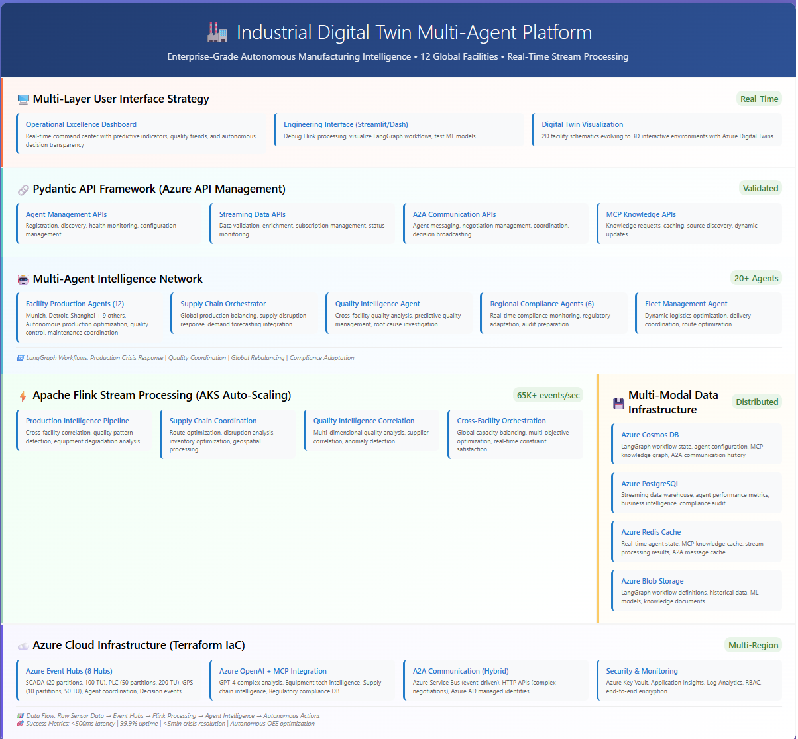

# Industrial Digital Twin Multi-Agent Platform

This repository contains the infrastructure and application code for an Industrial Digital Twin platform. It leverages Azure services to ingest, process, and store real-time data from various industrial simulators (SCADA, PLC, GPS). The platform is designed to be a foundation for building advanced analytics, real-time dashboards, and multi-agent autonomous systems.

The project is architected with a modular Terraform setup for infrastructure-as-code, and a robust Python application layer for simulation and stream processing.

## Architecture Overview

The platform consists of several key components:

- **Data Simulators (`/simulators`):** Python scripts that mimic real-world industrial equipment (SCADA, PLC, GPS) by generating and sending event data.
- **Event Ingestion (Azure Event Hubs):** A highly scalable event streaming service that decouples data producers from consumers.
- **Stream Processing (`event_stream_processor.py`):** A unified Python application that consumes events from Event Hubs, processes them, and archives them in a database.
- **Data Storage (Azure Cosmos DB):** A multi-model NoSQL database used to store the processed event data.
- **Web UI (`/dashboard`):** (In Development) A real-time dashboard for visualizing data and system status.
- **Intelligent Agents (`/agents`):** (In Development) The framework for building multi-agent systems that can analyze data and perform autonomous actions.

The following diagram illustrates the high-level architecture of the platform:



## Multi-Agent System Implementation Strategy

The platform is being evolved to include a multi-agent system for intelligent data analysis and interaction. The implementation follows a phased approach:

### Phase 1: The Foundational `DataQueryAgent`
A single agent integrated into the dashboard that can answer natural language questions about the event data.

#### Agent Data Flow

To ensure clarity, here is a step-by-step breakdown of how the agent retrieves and uses data:

1.  **Cosmos DB as the Source of Truth:** The raw event data from the SCADA, PLC, and GPS simulators is permanently stored in Azure Cosmos DB.
2.  **Backend Caching:** The backend Flask application (`dashboard/app.py`) reads the latest events from Cosmos DB and maintains a recent history of these events in memory. This caching strategy ensures the dashboard is fast and responsive, as it avoids querying the database for every user interaction.
3.  **User Interaction:** When a user asks a question in the agent chat window, the browser sends the question and the currently selected stream type (e.g., 'scada') to the `/api/ask` endpoint in the Flask application.
4.  **Agent Invocation:** The `/api/ask` endpoint invokes the `DataQueryAgent`. It provides the agent with the user's question and the relevant cached data stream from its memory.
5.  **LLM-Powered Analysis:** The agent then sends the question and the data to the configured Azure OpenAI Large Language Model (LLM). The LLM analyzes the data in the context of the question and generates a natural language response.
6.  **Displaying the Response:** The agent's response is sent back to the user's browser and displayed in the chat window.

In summary, the agent uses data that originates from Cosmos DB but accesses it via the backend's in-memory cache for performance. It does **not** directly query the database or call a separate API endpoint to get its data.

### Phase 2: Agent Specialization and A2A Communication
A second `AnalysisAgent` is introduced, enabling agent-to-agent communication for more complex data analysis tasks.

### Phase 3: Formalizing Communication with MCP
Basic A2A communication is replaced with a formal, scalable Model Context Protocol (MCP) server, decoupling the agents.

### Phase 4: Advanced Orchestration and Scaling
A sophisticated orchestration layer is built to manage complex workflows across a growing number of specialized agents.

## Getting Started

Follow these steps to set up the infrastructure and run the simulation environment.

### 1. Prerequisites

- [Azure CLI](https://docs.microsoft.com/en-us/cli/azure/install-azure-cli)
- [Terraform](https://www.terraform.io/downloads.html)
- [Python 3.8+](https://www.python.org/downloads/)

### 2. Infrastructure Deployment (Terraform)

First, deploy the necessary Azure resources using the provided Terraform scripts.

1.  **Authenticate with Azure:**
    ```sh
    az login
    ```
2.  **Navigate to the dev environment directory:**
    ```sh
    cd terraform/environments/dev
    ```
3.  **Initialize and apply the Terraform plan:**
    ```sh
    terraform init
    terraform plan
    terraform apply
    ```
    This will provision all the necessary resources, including Event Hubs, Cosmos DB, and a Key Vault.

### 3. Application Setup

Next, configure your local environment to run the Python simulators and processor.

1.  **Navigate to the simulators directory:**
    ```sh
    cd ../../../simulators 
    ```
    *(Note: If you are in `terraform/environments/dev`, navigate back to the root and then into `simulators`)*

2.  **Create and activate a Python virtual environment:**
    ```powershell
    # For Windows
    python -m venv .venv
    .venv\Scripts\Activate
    ```
    ```sh
    # For macOS/Linux
    python3 -m venv .venv
    source .venv/bin/activate
    ```

3.  **Install dependencies:**
    ```sh
    pip install -r requirements.txt
    ```

### 4. Security & Configuration

The application uses `DefaultAzureCredential` for secure, passwordless access to Azure resources.

1.  **Configure Environment File:**
    Create a `.env` file by copying the sample and adding your Key Vault URI.
    ```powershell
    # In the 'simulators' directory
    copy .env.sample .env
    ```
    Now, open `.env` and set the `KEY_VAULT_URI` variable:
    ```
    KEY_VAULT_URI="https://<your-key-vault-name>.vault.azure.net/"
    ```

2.  **Assign RBAC Permissions:**
    Your user account needs data-plane permissions on the Azure resources. Run the following Azure CLI commands, replacing `<your-principal-object-id>` with your user's Object ID (`az ad signed-in-user show --query id -o tsv`).

    ```sh
    # Set your identity's object ID
    PRINCIPAL_ID="<your-principal-object-id>"

    # Set your resource names (these are the defaults from Terraform)
    KEY_VAULT_NAME="idtwin-dev-kv"
    EVENT_HUBS_NAMESPACE="idtwin-dev-ehns"
    COSMOS_DB_ACCOUNT="idtwin-dev-cosmos"

    # Grant Key Vault access
    az keyvault secret set-permission --name $KEY_VAULT_NAME --object-id $PRINCIPAL_ID --permissions get list

    # Grant Event Hubs data access
    az role assignment create --role "Azure Event Hubs Data Owner" --assignee $PRINCIPAL_ID --scope "/subscriptions/$(az account show --query id -o tsv)/resourceGroups/idtwin-dev-rg/providers/Microsoft.EventHub/namespaces/$EVENT_HUBS_NAMESPACE"

    # Grant Cosmos DB data access (Contributor is needed for programmatic resource creation)
    az role assignment create --role "Contributor" --assignee $PRINCIPAL_ID --scope "/subscriptions/$(az account show --query id -o tsv)/resourceGroups/idtwin-dev-rg/providers/Microsoft.DocumentDB/databaseAccounts/$COSMOS_DB_ACCOUNT"
    ```

3.  **Configure Firewalls:**
    For local development, add your public IP address to the firewall rules for Key Vault and Cosmos DB in the Azure Portal.

## Running a Full Simulation

The easiest way to run the platform is using the `run_simulation.py` script, which starts and manages a simulator and its corresponding stream processor in one command.

1.  **Ensure your virtual environment is active** and you are in the `simulators` directory.
2.  **Run the simulation:**
    You can run all simulators in parallel, or specify a stream type (`scada`, `plc`, or `gps`) to run only that simulator. For example:

    ```powershell
    # Run all simulators in parallel
    python run_simulation.py

    # Run only the SCADA simulator
    python run_simulation.py scada

    # Run only the PLC simulator
    python run_simulation.py plc

    # Run only the GPS simulator
    python run_simulation.py gps
    ```
    You will see interleaved output from all running simulators, showing events being sent in real-time.

    To stop the simulation, press `Ctrl+C`.

### Running Components Manually (Alternative)

While `run_simulation.py` is the recommended way to run the platform for development, you can also run the stream processor and simulators manually in separate terminals. This can be useful for debugging individual components or for running only a subset of streams.

#### 1. Run All Simulators in Parallel

To launch all data simulators (SCADA, PLC, GPS) in parallel, use:

```sh
python run_simulation.py
```

This will start all three simulators as separate processes. Press `Ctrl+C` to stop all simulators at once. The script will handle graceful shutdown and process cleanup.

#### 2. Run a Single Simulator and Processor Pair

You can also run a single simulator and its corresponding processor for focused testing. For example, to run only the SCADA stream:

```sh
python run_simulation.py scada
```

Valid arguments are:
- `scada` — runs only the SCADA simulator
- `plc` — runs only the PLC simulator
- `gps` — runs only the GPS simulator
- No argument — runs all simulators in parallel

#### 3. Run the Event Stream Processor (Python)

The unified event stream processor can be run directly and requires the `--stream-type` argument to specify which stream to process. For example:

```sh
python event_stream_processor.py --stream-type scada
```

Valid arguments for `--stream-type` are:
- `scada` — process SCADA events
- `plc` — process PLC events
- `gps` — process GPS events
- (If supported) `all` — process all streams

**Example: Run the SCADA processor and simulator in separate terminals:**

Terminal 1:
```sh
python event_stream_processor.py --stream-type scada
```

Terminal 2:
```sh
python scada_simulator.py
```

**Example: Run all simulators and processors in parallel:**

Terminal 1:
```sh
python run_simulation.py
```

Terminal 2 (optional, for a specific processor):
```sh
python event_stream_processor.py --stream_type scada
```

**Notes:**
- The simulators and processor rely on the `.env` file for configuration (Key Vault URI, etc.) and use Azure AD to authenticate. Ensure you have logged in with `az login` and have the required permissions.
- You can control the event rate for each simulator by setting the `SCADA_EVENT_RATE`, `PLC_EVENT_RATE`, or `GPS_EVENT_RATE` environment variables.
- These simulators are for development and testing purposes only.

## Advanced Stream Processing (Apache Flink)

For more complex, stateful stream processing scenarios, this project includes a Maven-based Java application using Apache Flink. It processes the same event streams from Event Hubs (using its Kafka endpoint) and writes the results to Azure Cosmos DB, authenticating via Azure AD.

### Flink Prerequisites

Before you can build and run the Flink job, you will need the following installed on your system:

1.  **Java Development Kit (JDK) 11:**
    -   The project is standardized on the **Microsoft Build of OpenJDK 11**.
    -   You can install it on Windows via `winget install Microsoft.OpenJDK.11` or download it from the official Microsoft site for other operating systems.
    -   **Crucially**, you must set the `JAVA_HOME` environment variable to point to the JDK's installation directory.

2.  **Apache Maven:**
    -   A build automation tool used for Java projects.
    -   You can download it from the [official Maven website](https://maven.apache.org/download.cgi).
    -   Ensure the `mvn` command is available in your system's PATH.

### Flink Configuration

The Flink job is configured using environment variables defined in the `.env` file in the **project root directory**. Ensure the following variables are set correctly:

```
# Flink Job Configuration
# Replace <YourEventHubsNamespace> with your actual Event Hubs Namespace
KAFKA_BOOTSTRAP_SERVERS=<YourEventHubsNamespace>.servicebus.windows.net:9093
FLINK_KAFKA_TOPICS=scada-production-hub,plc-control-hub,gps-logistics-hub

# Cosmos DB Configuration (used by the Flink Job)
COSMOS_DB_ENDPOINT=https://<YourCosmosDbAccount>.documents.azure.com:443/
COSMOS_DB_DATABASE=industrial-digital-twin-db
```

**Authentication:** The job uses `DefaultAzureCredential` for authenticating to Cosmos DB, so no keys are needed in the `.env` file. Ensure you are logged in via the Azure CLI (`az login`) or have the appropriate service principal environment variables set for authentication to work.

### Building the Flink Job

To compile the Java source code and package it into a runnable JAR file, navigate to the `flink-java` directory and run the following Maven command:

```sh
# From the project root
cd flink-java
mvn clean package
cd ..
```

This will create a JAR file in the `flink-java/target/` directory (e.g., `flink-java-1.0-SNAPSHOT.jar`).

### Running the Flink Job

Once the JAR file is built, you can submit it to a running Flink cluster. For local development, you can use a standalone Flink distribution.

1.  **Download Apache Flink:** Download a stable Flink distribution (e.g., Flink 1.17 or later) from the [official Flink website](https://flink.apache.org/downloads/).

2.  **Start a Local Flink Cluster:**
    ```sh
    # Navigate to your Flink distribution directory
    # cd /path/to/flink-1.17.x

    # Start the cluster
    ./bin/start-cluster.sh
    ```

3.  **Submit the Job:**
    From the Flink distribution directory, use the `flink run` command to submit your JAR. You will need to provide the absolute path to the JAR file created in the previous step.

    ```sh
    # Example from within the Flink distribution directory
    ./bin/flink run c:\Projects\GithubLocal\industrial-digital-twin-multiagent-platform\flink-java\target\flink-java-1.0-SNAPSHOT.jar
    ```

You can monitor the job's progress through the Flink Web UI, which is typically available at `http://localhost:8081`.

## Project Structure

```
industrial-digital-twin-multiagent-platform/
├── .github/                  # CI/CD workflows and GitHub Actions
├── agents/                   # Python code for intelligent agents (in development)
├── dashboard/                # Web-based UI for data visualization (in development)
├── docs/                     # Project documentation and architecture diagrams
│   ├── industrial_architecture_diagram.png   # Architecture diagram (image)
│   └── ...
├── flink-java/               # Maven project for the Flink Java stream processor
│   ├── src/main/java/com/industrialdigitaltwin/flink/
│   │   ├── StreamingJob.java         # Main Flink job (reference implementation)
│   │   ├── ScadaEvent.java           # SCADA event POJO
│   │   ├── GpsEvent.java             # GPS event POJO
│   │   ├── PlcEvent.java             # PLC event POJO
│   │   ├── EnrichedEvent.java        # Output of cross-stream join
│   │   ├── MovingAverageAggregate.java # Windowed aggregation logic
│   │   └── ...                       # Additional Flink utilities and classes
│   ├── pom.xml                       # Maven build configuration
│   └── ...
├── simulators/                # Python scripts for data generation
│   ├── scada_simulator.py     # SCADA event generator
│   ├── plc_simulator.py       # PLC event generator
│   ├── gps_simulator.py       # GPS event generator
│   ├── run_simulation.py      # Orchestrates processor and simulator for dev
│   ├── event_stream_processor.py # Unified Python stream processor
│   ├── requirements.txt       # Python dependencies
│   └── ...
├── terraform/                 # Terraform modules for infrastructure-as-code
│   ├── modules/               # Reusable infrastructure components
│   └── environments/          # Environment-specific configs (dev, staging, prod)
├── industrial_architecture_diagram.html # Interactive architecture diagram
├── PROJECT-DECISIONS.md       # Log of key architectural and technical decisions
├── README.md                  # This file
└── ...                        # Other root-level files (e.g., .env.sample, .gitignore)
```

- **Each major component is modularized for clarity and scalability.**
- **Terraform** manages all Azure infrastructure, with clear separation between reusable modules and environment-specific settings.
- **Simulators** and **stream processors** are decoupled, supporting both Python and Java (Flink) implementations.
- **Documentation** is comprehensive, with all major decisions and troubleshooting steps logged for future reference.

---

## Platform Limitations: Process Management on Windows

> **Note:** On Windows, Python's signal and process management is limited. Even with robust signal handling and aggressive use of `taskkill`, simulator and processor subprocesses may persist after pressing Ctrl+C. If this occurs:
>
> - Open Task Manager and manually end any remaining `python.exe` processes related to your simulation.
> - For a more reliable developer experience, consider running the platform in WSL (Windows Subsystem for Linux) or a Linux VM/container.
> - This is a known limitation of Python and the Windows platform, not a project bug.

---

## Flink Integration: Java/Scala vs PyFlink

- **Flink jobs will be developed in Java/Scala for maximum performance, feature parity, and community support.**
- PyFlink is suitable for prototyping and simple pipelines, but not for advanced or production workloads.
- Java/Scala Flink development requires a local JDK (and Scala for Scala jobs). PyFlink only requires Python, but with noted limitations.
- Flink integration will be developed in a new branch for clean iteration and review.

## Project Evolution: From Python Ingestion to Advanced Flink Stream Processing

### Phase 1: Python-Based Stream Processor (Foundational Ingestion)

- The project began with a unified Python stream processor (`event_stream_processor.py`) that consumes events from Azure Event Hubs and writes them to Cosmos DB.
- This approach prioritized rapid prototyping, secure authentication (using Azure AD and Key Vault), and robust infrastructure-as-code (Terraform) for all Azure resources.
- The Python processor uses `DefaultAzureCredential` for passwordless authentication and programmatically ensures Cosmos DB containers and indexes exist, making onboarding and local development seamless.
- All simulators (SCADA, PLC, GPS) generate cryptographically unique event IDs at the source, ensuring data integrity and traceability throughout the pipeline.
- The Python ingestion pipeline is still the recommended starting point for new developers and is ideal for simple, stateless processing and rapid iteration.

### Phase 2: Advanced Stream Processing with Apache Flink (Java)

- As requirements for real-time analytics, cross-stream joins, and stateful processing emerged, the project evolved to include a Java-based Flink job (`flink-java`).
- Flink connects to Azure Event Hubs using the Kafka protocol endpoint, enabling high-throughput, low-latency stream processing with full support for event-time semantics and advanced windowing.
- The Flink job demonstrates:
  - **Cross-Stream Join:** Joins SCADA and GPS streams by device/unit ID within a configurable time window using Flink's `intervalJoin` API. This enables event correlation and enrichment (e.g., associating sensor readings with location data).
  - **Stateful Processing:** Implements windowed aggregations (such as moving averages) using Flink's keyed state and window APIs. This is the foundation for anomaly detection, trend analysis, and other advanced analytics.
  - **Output Enrichment:** The joined and aggregated results can be written to Cosmos DB or other sinks, making them available for downstream applications and dashboards.
- The Flink reference implementation is modular and extensible, serving as a template for future analytical features and production workloads.

### Why This Evolution?
- **Iterative Value:** Starting with Python allowed the team to deliver a working ingestion pipeline quickly, validate the architecture, and focus on security and developer experience.
- **Separation of Concerns:** The Python processor is optimized for ingestion and durability; Flink is introduced for advanced analytics and real-time intelligence.
- **Open Collaboration:** By supporting both AMQP (Python SDK) and Kafka (Flink/Java) protocols on Event Hubs, the platform is accessible to a wide range of developers and tools.
- **Scalability:** Flink's distributed architecture and stateful processing capabilities enable the platform to scale to complex, high-volume workloads as requirements grow.

### Example: Flink Reference Implementation Features

- **Cross-Stream Join:**
  - Joins SCADA and GPS events by device/unit ID and event time window (e.g., ±30 seconds).
  - Uses Flink's `intervalJoin` or `CoProcessFunction` for event correlation.
- **Stateful Windowed Aggregation:**
  - Computes moving averages and other aggregations over sliding windows using Flink's window APIs.
  - Supports anomaly detection and trend analysis.
- **Output Enrichment:**
  - Produces enriched event objects that combine data from multiple streams.
  - Results can be written to Cosmos DB or other sinks for use by dashboards and agents.

### Running the Flink Reference Job

- See the [Flink Configuration](#flink-configuration) and [Running the Flink Job](#running-the-flink-job) sections above for detailed setup and execution instructions.
- The Flink job is designed to be run in a local or cloud Flink cluster, with all configuration managed via environment variables and `.env` files for consistency with the rest of the platform.

### Developer Workflow and Best Practices

- **Edit in Windows/VS Code, Build in WSL:**
  - For maximum compatibility, edit Java code in VS Code on Windows, but build and run Flink jobs in WSL (Ubuntu) or Linux. This avoids issues with line endings, permissions, and deprecated Windows support in Flink.
  - Set `JAVA_HOME` and `PATH` in your WSL environment as described in the [PROJECT-DECISIONS.md](PROJECT-DECISIONS.md) and this README.
- **Branching Strategy:**
  - All new features and prototypes are developed in dedicated feature branches and merged into `main` after review and testing.
- **Comprehensive Documentation:**
  - All major architectural decisions, and developer workflows are documented in this README for future reference and onboarding.

## Viewing Events: Dashboard Web UI

The platform includes a web-based dashboard for visualizing event data and system status. The dashboard is implemented as a Flask application in the `dashboard/` directory.

### How to Run the Dashboard

1. **Navigate to the dashboard directory:**
    ```powershell
    cd dashboard
    ```
2. **(Optional) Create and activate a Python virtual environment:**
    ```powershell
    python -m venv .venv
    .venv\Scripts\Activate
    ```
3. **Install dependencies:**
    ```powershell
    pip install -r requirements.txt
    ```
4. **Run the Flask app:**
    ```powershell
    python app.py
    ```
    By default, the dashboard will be available at:
    
    **http://localhost:5000**

    If you want to run the dashboard on a different port, you can set the `PORT` environment variable before running the app:
    ```powershell
    $env:PORT=8080
    python app.py
    ```
    The dashboard will then be available at `http://localhost:8080`.

### Accessing the Dashboard

- Open your browser and go to [http://localhost:5000](http://localhost:5000) (or the port you specified).
- The dashboard will display real-time or recent event data ingested by the platform.

**Note:**
- The dashboard is in active development. Features and UI may change.
- Ensure the simulators and event stream processor are running so that data is available for visualization.
- For troubleshooting, check the terminal output for errors when starting the dashboard.

---

## Flink and CosmosDB Integration Testing (Deferred)

> **Note:** Integration testing between the Flink job and Azure Cosmos DB is currently **deferred**. The Flink reference implementation is scaffolded and documented, but end-to-end integration and validation with Cosmos DB will be completed in a future phase. This allows the team to focus on agent/AI integration and other platform priorities. 
>
> **Reference Implementation:** The Python event stream processor (`event_stream_processor.py`) provides a fully documented, working example of Cosmos DB integration using Azure AD authentication and the Azure SDK. Users seeking to understand or reuse Cosmos DB integration patterns should refer to the Python implementation and its documentation in this repository.
>
> Please refer to this section for updates on Flink/CosmosDB testing status.

---

